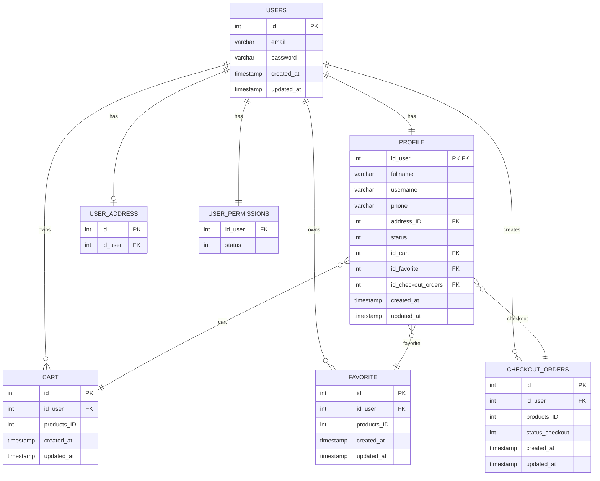

# BeliMudah

## Entity Relationship Diagram (ERD)
 
ERD dari database program e commerce belimudah yang dibuat dengan konsep database migrations.

### Tech stack:
- PostgreSQL 18.4
- github.com/golang-migrate/migrate/v4/cmd/migrate@latest

### Schema:
